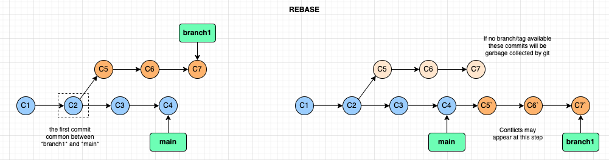

- [Git internals](#git-internals)
- [There are 3 areas used by Git](#there-are-3-areas-used-by-git)
- [MANGING CONFLICTS when merging](#manging-conflicts-when-merging)
- [Removing / Renaming files](#removing--renaming-files)
- [Tags](#tags)
- [Remotes](#remotes)
- [ToDo](#todo)

## Git internals
- Internal git objects - kept in *.git/objects* folder
    - Blobs: file content
    - Trees: folders
    - Commits: the commits
    - Annotated Tags: metadata / label for a commit
- Branches - are kept in .git/refs/heads folder
- HEAD file contains the reference to the “active branch” (where the next commit will happen)
- A MERGE is just a *special commit* - it has 2 parents.
- Sometimes, the branches in the refs folder are packed/compressed in the *packed-refs* file
    - Use *git show-ref* command to get the branch details in this case
```
# Dispay the object content (-p is pretty print) ... use -t if you want to see object type
> git cat-file -p sha1

# Show all branches that have "main" in their name
> git show-ref main
```

## There are 3 areas used by Git
- **WORKING** area: any new files or any change goes here first
- **STAGING** area (Index): when you **add** the changes to git, these changes are placed here.
    - This is where you prepare the content of the next commit
    - Use **add** command to add changes in the staging area
- **REPOSITORY** area: this is where you actually commit the changes into git
    - It will take all the work from the staging area, create a “commit” (which will have a unique ID) and save it in git
    - Use the **commit** command
```
# Initialize a new git repository
> git init

# configuring git
#   --local: applies the configurations for the current repo only
#   --global: applies the configurations for the user directory
#   --system: applies the configurations for the git instalation
> git config --local user.name "First Last"
> git config --local user.email "email@address"

# remove configs
# remove a specific setting from a specific config level
> git config --global --unset user.name
# Edit a config level
> git config --global --edit
# Remove a confic section
git config --global --remove-section user

# View configuration values
> git config --list --show-origin       # shows all configs from all sources
> git config user.name                  # shows the value of user.name

# Add files to staging area
> git add ...

# Commit the data from staging area
> git commit -m "Comment"

# Add & Commit in a single line
> git commit -a -m "Comment"

# See the list of commits
> git log

# get the status of your files
> git status
> git status -s        # --> the short variant

# Diff between WORKING and STAGING areas
> git diff

# Diff between STAGING and REPOSITORY areas
# What are the changes that I have done that will go into the next commit?
> git diff --cached
> git diff --staged
```

## MANGING CONFLICTS when merging
- The conflict files will have comments with the conflicts -> these need to be addressed manually
- After you handled the conflict, you need to ADD the new version of the filw to the staging area (git add ...) then you run commit again
- FAST-FORWARD: You have *branch1* and you want to merge it into *main*
    - You go on *main* and do a merge with *branch1* -> now *main* points to the result of the merge
    - Then you go on *branch1* and you want to move this branch to the same commit *main* points to
        - Just run *git merge main* from the *branch1* branch -> this will be done by simply moving (fast forwarding) the *branch1* branch to point to the same commit as *main*
- HEAD-less commit: it’s when HEAD points directly to a commit instead of a branch
    - You get in this situation if you *checkout* a commit’s sha1 instead of a branch
    - This is done to run experiments that you don't know if you want to keep around
        - If you want to give-up - just move to a branch (checkout/switch to a branch) - all the headless commits will be garbage-collected by git as they are not referenced by a branch
        - If you want to keep them - create a branch on the latest commit.
- REBASE
    - I am on *branch1* and I want to rebase with *main*
    - Git will identify the first commit common between *branch1* and *main* (*common_commit*)
    - Git will take all the commit chain between *common_commit* and *branch1* and put them on top of *main* (new commits are being created with identical content as the commits between *common_commit* and *branch1* - but the commit hashes will differ - that's why these are new commits in git objects database)
        - Conflicts may appear at this step
    - *branch1* will be pointing to the new commits on top of *main*
        - The old commits that have been rebased no longer have a branch pointing to them, thus will be garbage-collected by git
    - If you do a merge of *main* with *branch1* then this will be a simple fast-forward!


```
# See the current branches
> git branch
> git branch --all    # lists also the remote branches

# Create a new branch
> git branch branch_name

# Switches to a branck (HEAD changes to point to the new branch) AND 
# copies data from REPOSITORY area to the WORKING and STAGING areas
> git switch branch_name
> git checkout branchname
```

## Removing / Renaming files
- If the file was added in STAGE but not yet in REPOSITORY.
    - If I want to remove the file from both WORKING and STAGE: *git rm -f filename*
    - If I want to remove the file from STAGE but not from WORKING (unstage the file): *git rm --cache filename*
- Renaming the readme.txt to readme.md
```
# Option 1: using add
# -> In this step git sees that readme.txt is deleted and readme.md new
> mv readme.txt readme.md
# -> In this step git actually discovers that the file was renamed
> git add readme.txt        # this means copy the deletion of readme.txt from WORKING to STAGE area
> git add readme.md
> git commit

# Option 2: using git mv
> git mv readme.txt readme.md
> git commit
```

## Tags
- There are 2 types of tags
    - Annotated tags: *git tag tag1 -a -m “Message”*
        - This will create a tag *tag1* (saved in *.git/refs/tags*) which will point to a new git object (type: annotated tag) which will point to the current commit object
    - Lightweight tags: *git tag tag2 -m “Message”*
        - This will create a tag *tag2* (saved in *.git/refs/tags*) which will point directly to the current commit object
- Use *git checkout* to switch to tags (*git switch* does not wok for tags)

## Remotes
- These are git repos our git repo can synchronize with
- The default remote is called *origin*
- Branches in remotes are kept in *.git/refs/remotes*
- Merging in a remote origin is done by
    - First bringing the remote data locally (git fetch)
    - Merge the local changes with the remote data that was just synced (git merge)
    - Push the final merge to remote (git push)
- PUSH - this is a command that does the fetch from a remote and the merge with the local version of the branch in a single step
```
# See the remotes
> git remote -v

# To add a remote
> git remote add <remote_name> <remote_url>

# Add remote repo
> git remote add origin git@github.com:mdfecioru/toolsdoc.git

# Pushing code on the repote repo
# A link is created between the local "master" and the remote "master"
# -> once this link is made, just use "git push"
> git push -u origin master
```

## ToDo
- git pull --rebase
- clone --bare
  - A repository that does not have a working copy
  - In this case, the root folder os the content of the .git
- git commit --amend
- git bisect
